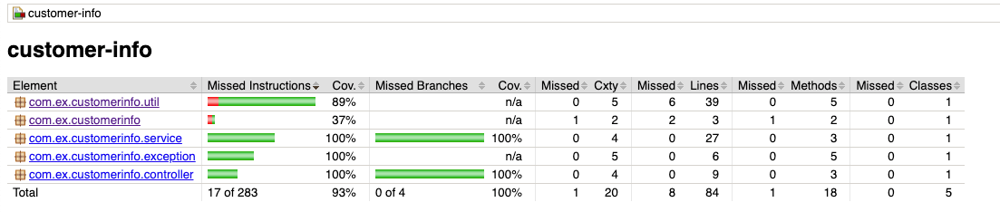

# Spring Boot Application: Customer Info Management

## Overview

This Spring Boot application manages customer information, providing RESTful APIs for Get/Post operations. The main components include:

- `CustomerController`: Exposes REST endpoints for customer operations.
- `CustomerService`: Implements business logic for customer management.
- `CustomerRepository`: Manages database interactions for customer entities.
- `CustomerCsvImport`: Component for importing customer data from CSV files.
- `Customer`: Model representing customer information.
- `CustomExceptionHandler`: Handles custom exceptions and returns appropriate responses.
- `ErrorResponse`: Model representing error responses.

## Technologies Used

- **Spring Boot**: Framework for building Java-based enterprise applications.
- **H2 Database**: In-memory database used for development and testing.
- **Lombok**: Library for reducing boilerplate code.
- **Jacoco**: Code coverage tool for generating coverage reports.

## Running the Application

Clone the repository:

   ```bash
   git clone https://github.com/your-username/customer-management.git
```
## Build and Run the Application

```bash
cd customer-management
./mvnw spring-boot:run
```

## Accessing the application
The application will be accessible at http://localhost:8080

## API Endpoints


#### Get Customer by ID:
GET /api/customers/{id}
#### Create Customer: 
POST /api/customers

## OpenAPI Documentation

Explore the API using the OpenAPI documentation available at:

http://localhost:8080/v3/api-docs

This documentation provides details about each endpoint, request/response, validation and error details.

## Running JUnit Tests

#### Execute the following command to run tests:

   ```bash
./mvnw clean test
```
#### Jacoco Code Coverage Report

To generate Jacoco coverage reports, run:

   ```bash
./mvnw clean test
```
##### Jacoco report can be accessed from folder target/site/jacoco/index.html



## CSV Data Import

Customer data is imported from the **customers.csv** file into the **H2 customer_info** database using the **CustomerCsvImport** component class. This process invokes the **Create Customer endpoint (/api/customers)** during the startup of the Spring Boot Application.

## Database
H2 database is used by default for development and testing, it can be accessed at http://localhost:8080/h2-console/

##### H2-Console Login Credentials

   ```bash
Driver Class=org.h2.Driver
JDBC URL=jdbc:h2:mem:customer_info
username=db-user      (used only for testing purpose)
password=}B6So5X0^42t (used only for testing purpose)
```